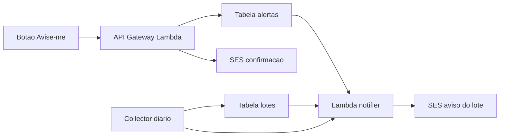

# Avise-me: alerta por e-mail sem conta

Status: **adiado** — implementar depois da busca textual na página estática.

Adicionar o botão Avise-me no site estático, persistir alertas no DynamoDB identificados só pelo e-mail (com confirmação por link) e, após cada coleta, enviar e-mail SES com os dados completos do lote quando o texto e o lance opcional baterem.

O dashboard em `docs/` é estático (GitHub Pages). Cadastro e envio de e-mail exigem backend na stack SAM já existente (`infra/template.yaml`): API Gateway + Lambda + DynamoDB + SES.

O e-mail é o único identificador. Cada alerta fica amarrado a um e-mail normalizado; o matcher só envia para aquele endereço. Confirmação por link (double opt-in) antes de ativar.

## Cadastro no site

Botão **Avise-me** no header de `docs/index.html` (ao lado do meta). Abre um modal com:

- E-mail (obrigatório)
- Texto do carro, ex. `Jetta GLI` (obrigatório, mínimo 3 caracteres)
- Lance máximo opcional (número em R$)
- Texto curto: “sem conta; confirme no e-mail para ativar”

Após o POST: mensagem “enviamos um link de confirmação”. O link “Sodré” nos cards continua indo para o leilão, sem abrir o modal.

URL da API em `docs/config.js` (`alertsApiUrl`), lida por `docs/app.js`. CORS liberado para `https://radar.angelocupertino.com.br`.

## API (sem autenticação)

HTTP API em SAM, Lambda `alerts.handler`:

- `POST /alerts` — cria alerta `pending`, envia e-mail de confirmação
- `GET /alerts/confirm?token=` — ativa o alerta
- `GET /alerts/unsubscribe?token=` — desativa aquele alerta

Validações: e-mail RFC simples, texto sanitizado, teto de **20 alertas ativos/pending por e-mail**, recusa duplicata (mesmo e-mail + mesmo texto + mesmo lance). Sem listagem pública por e-mail (evita enumerar alertas de terceiros). Gestão só pelos links do e-mail.

## Persistência

Nova tabela `leilao-radar-alertas` (on-demand):

- PK `alert_id` (UUID)
- GSI `gsi_email`: `email` + `created_at` (consultar alertas de um usuário)
- Campos: `email`, `query_text`, `query_norm`, `max_lance` (opcional), `status` (`pending` | `active` | `unsubscribed`), `confirm_token`, `unsub_token`, `notified_lote_ids` (conjunto), timestamps

Match: substring case-insensitive (e sem acento) de `query_norm` em `titulo`, `marca` ou `modelo`. Se houver `max_lance`, só notifica se `lance_atual <= max_lance`. Lote que ainda está acima do lance **não** entra em `notified_lote_ids`, para avisar depois se o lance cair.

## Quando dispara o e-mail

Depois do collector (`collector/handler.py`), a Lambda `leilao-radar-notifier` é invocada de forma assíncrona (dados já no DynamoDB).

Para cada alerta `active`: varrer lotes LIVE, aplicar match + lance, pular `lote_id` já em `notified_lote_ids`, enviar 1 e-mail HTML por lote, gravar o id.

Conteúdo do aviso (espelha o lightbox): título, data do leilão, fim do lote, prazo, match FIPE, lance, FIPE, desconto, custo +5%, classificação, sinistro, pátio, relevância, ID, link Sodré, fotos (imagens + URLs). Rodapé com **cancelar este alerta**.

E-mail de confirmação: resumo do texto/lance e botão “Ativar alerta”.

## Infra AWS (`infra/template.yaml`)

- Tabela de alertas + TTL opcional só em tokens pending (ex. 7 dias sem confirmar)
- `AlertsApiFunction` (timeout curto) com HTTP API, CORS, IAM DynamoDB + SES
- `NotifierFunction` com SES + leitura das duas tabelas
- Parâmetro `SenderEmail` (ex. `avisos@radar.angelocupertino.com.br`)
- Output `AlertsApiUrl` para colar em `docs/config.js`

**Passo manual (AWS):** verificar identidade SES em `sa-east-1` (domínio `angelocupertino.com.br` ou o e-mail remetente) e sair do sandbox do SES. Sem isso o double opt-in só entrega em endereços já verificados.

## Código novo / tocado

- `alerts/handler.py` — API
- `alerts/notify.py` — matcher + HTML + SES
- `alerts/repo.py` — DynamoDB dos alertas
- `shared/matching.py` — normalização e match (testável)
- `collector/handler.py` — invoke do notifier no fim
- `docs/index.html`, `docs/app.js`, `docs/style.css`, `docs/config.js`
- `scripts/init_dynamodb.py` — tabela local
- Testes unitários do match e das regras de lance

## Tarefas

1. SAM: tabela de alertas, HTTP API, Lambdas API + notifier, SES IAM, output da URL
2. API POST/confirm/unsubscribe, repositório DynamoDB, double opt-in via SES
3. Matcher por texto/lance, e-mail HTML com dados+fotos, dedupe por lote, invoke pós-collector
4. Botão Avise-me, modal (e-mail, texto, lance opcional) e config da API
5. Testes do match e nota de verificação SES no README

Fora de escopo: login, listar alertas digitando o e-mail no site, Streamlit.
